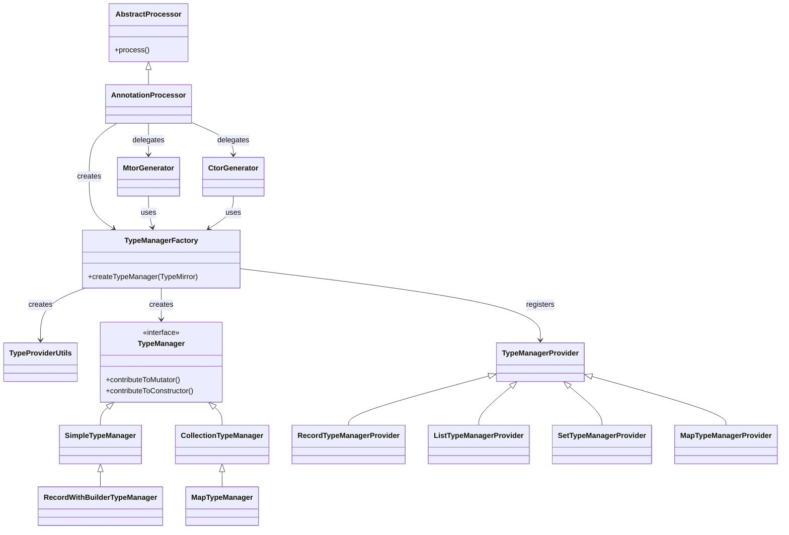

# Architecture

The Java Record Mutator Generator (JRMG) is designed as a modular system centered around Java's annotation processing
capabilities. It automates the creation of builder patterns (mutators) and constructors for immutable Java records,
enabling a fluent API for data modification and creation.

## System Architecture

The project is organized as a Gradle multi-module project with three primary modules:

1. **`api`**
    * **Purpose:** Defines the public API used by developers to annotate their records and the runtime support classes
      required by the generated code.
    * **Key Components:**
        * `@GenerateMtor`: The marker annotation for generating mutators (builders for modifying existing instances).
        * `@GenerateCtor`: The marker annotation for generating constructors (builders for creating new instances from
          scratch).
      * `@GenerateCtorAndMtor`: The marker annotation for generating both constructors and mutators.
        * `Builder<T>`: The functional interface implemented by all generated builders.
        * Runtime support classes for collections (e.g., `ListBuildImpl`, `SetBuilderImpl`, `MapBuilderImpl`) and their
          corresponding interfaces for both Ctor and Mtor variants (e.g., `NestedListCtor`, `SimpleListMtor`).
    * **Dependencies:** None (pure Java).

2. **`annotation-processor`**
    * **Purpose:** Contains the compile-time logic to analyze annotated records and generate the source code for
      mutators and constructors.
    * **Key Components:**
        * `AnnotationProcessor`: The main entry point for annotation processing. It delegates to `MtorGenerator` or `CtorGenerator`.
        * `MtorGenerator`: Handles the generation logic for mutators.
        * `CtorGenerator`: Handles the generation logic for constructors.
      * `TypeManagerFactory`: Creates `TypeManager` instances based on the type of record components.
      * `TypeManager` hierarchy: Encapsulates the logic for generating code for different types (primitives, records,
        collections). Implementations include `SimpleTypeManager`, `RecordWithBuilderTypeManager`,
        `CollectionTypeManager`, and
        `MapTypeManager`.
    * **Dependencies:** `api`, `auto-service`, `javapoet`.

3. **`example-project`**
    * **Purpose:** Demonstrates the usage of the library and serves as an integration test bed.
    * **Key Components:** Domain objects (records) representing a shipment system.
    * **Dependencies:** `api`, `annotation-processor`.

## Source Code Paths

* **API:** `api/src/main/java/io/github/larsarv/jrmg/api/`
* **Processor:** `annotation-processor/src/main/java/io/github/larsarv/jrmg/annotation/processor/`
* **Example:** `example-project/src/main/java/io/github/larsarv/jrmg/example/project/`

## Key Technical Decisions

### Annotation Processing

The core mechanism is Java's standard annotation processing API (`javax.annotation.processing`). The project utilizes a
single `AnnotationProcessor` that delegates to `MtorGenerator` and `CtorGenerator` to handle the distinct logic for
generating mutators and constructors respectively. This separation allows for cleaner separation of concerns while
sharing common logic through shared utilities and the `TypeManager` hierarchy.

### Code Generation with JavaPoet

The project uses [JavaPoet](https://github.com/square/javapoet) to generate Java source code. JavaPoet provides a robust
API for building Java files, handling imports, and ensuring correct syntax.

### Type Handling Strategy

The processor uses a strategy pattern to handle different types of record components. The `TypeManager` interface and
its
implementations (`SimpleTypeManager`, `RecordWithBuilderTypeManager`, `CollectionTypeManager`, `MapTypeManager`)
encapsulate the
specific logic for generating methods for each type.

* `SimpleTypeManager`: Handles primitives and simple objects.
* `RecordWithBuilderTypeManager`: Handles nested records that may also have generated builders.
* `CollectionTypeManager` & `MapTypeManager`: Handle collections, supporting both simple elements and nested mutable
  elements.

The `TypeManagerFactory` is used to instantiate the correct `TypeManager` implementation based on the component type. It
uses a provider pattern with `TypeManagerProvider` implementations for different types (records, lists, sets, maps).

### Fluent API Design

The generated code follows a fluent API design:

* **Mtor (Mutator):**
    * `setFieldName(Value v)`: Sets a value and returns `this`.
    * `mutateFieldName(Function<Mutator, Mutator> f)`: Allows modifying nested immutable objects in place.
    * `construct(Function<Constructor, Builder> f)`: Allows constructing a new nested object using its Ctor.
* **Ctor (Constructor):**
    * Enforces a strict order of initialization.
    * Uses a chain of interfaces to ensure all fields are set before `build()` can be called.
    * `constructor()`: Static entry point.

## Component Relationships

## Critical Implementation Paths

1. **Initialization:** The `AnnotationProcessor` initializes and sets up the `MtorGenerator` and `CtorGenerator`, which
   in turn use the `TypeManagerFactory` to resolve types.
2. **Discovery:** The processor finds elements annotated with `@GenerateMtor` or `@GenerateCtor`.
3. **Delegation:** The processor delegates to `MtorGenerator` or `CtorGenerator` based on the annotation.
4. **Analysis:** For each record, the generator iterates through its components.
5. **Type Resolution:** The `TypeManagerFactory` determines the correct `TypeManager` for each component using
   `TypeManagerProvider` implementations, checking for primitives, collections, maps, or other annotated records.
6. **Generation:** The `TypeManager` objects contribute methods (setters, getters, mutators, constructors) to the
   `TypeSpec.Builder`.
    * `MtorGenerator` generates `*Mtor` classes.
    * `CtorGenerator` generates `*Ctor` classes.
7. **Output:** The generated Java files are written to the filer.